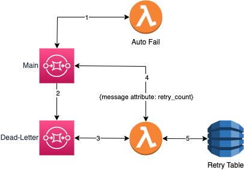

# Table of Contents
- [SQS Retry Handler with DLQ and DynamoDB](#sqs-retry-handler-with-dlq-and-dynamodb)
  - [Overview](#overview)
  - [Exponential Backoff for Retries](#exponential-backoff-for-retries)
    - [How Exponential Backoff Works](#how-exponential-backoff-works)
    - [Benefits of Exponential Backoff](#benefits-of-exponential-backoff)
    - [Configuration](#configuration)
  - [References](#references)

# SQS Retry Handler with DLQ and DynamoDB

This project demonstrates a retry handler for AWS Lambda using Amazon SQS (Simple Queue Service), Dead Letter Queue (DLQ), and DynamoDB. The Lambda function processes messages from an SQS DLQ, tracks the retry count, and takes actions based on the retry count.

## Overview



1. Message is sent from the main-queue to a lambda that is setup to [automatically fail](./files/autofail.py). This will repeat based on the [number_of_retries](./variables.tf) variable value.
2. After number of retries is hit in step one the message will be sent to the dlq.  
3. DLQ will automatically trigger the [retry function](./files/dynamoinsert.py).  This function:
    - Check if the message attribute `retry_count` exists if not it will create and set to zero
4. if the `retry_count` is less than `number_of_retries`:
    - increment `retry_count` by 1
    - configure [exponential backoff](./documentation/EXPONENTIAL.MD)
    - send back to the main queue
5. if the `retry_count` is greater than or equal to `number_of_retries`
    - put the message into the dynamodb retry table for further investigation

## Prerequisites
Before you begin, make sure you have the following prerequisites:

* [Terraform](https://developer.hashicorp.com/terraform/tutorials/aws-get-started/install-cli) installed on your local machine.
* An AWS account.
* AWS access key and secret key with sufficient permissions to create resources.

## Infrastructure Setup

* Clone the repository to your local machine.
* Navigate to the project directory.
* Create a `terraform.tfvars` adding your AWS_ACCESS_KEY, AWS_SECRET_KEY, and REGION.
* Run `terraform init` to download the necessary provider plugins.
* Run `terraform plan` to preview the changes that Terraform will make to your infrastructure.
* Run `terraform apply` to create the infrastructure on AWS.
* When you are finished using the infrastructure, run `terraform destroy` to delete all the resources that Terraform created.

## Testing through console

1. Run [Infrastructure Setup](#infrastructure-setup)
2. Log into [AWS Console](https://aws.amazon.com/console/)
3. Navigate to SQS
    - select `main-queue`
    - select `Send and receive messages`
    - type in message you want to send and click `send message`

## Testing through cli

1. Run [Infrastructure Setup](#infrastructure-setup)
2. Copy queue url from the terraform output
3. Run CLI command

```cli
aws sqs send-message --queue-url <QUEUE_URL> --message-body "Your message content" --region <YOUR_REGION>
```

### References

- [Using Amazon SQS dead-letter queues to replay messages](https://aws.amazon.com/blogs/compute/using-amazon-sqs-dead-letter-queues-to-replay-messages/)
